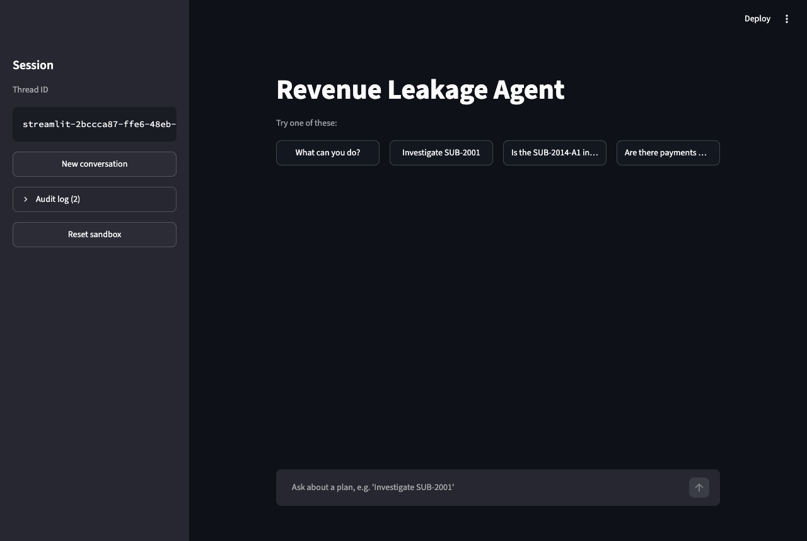
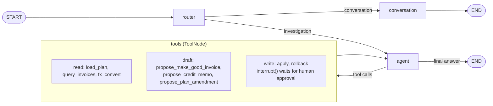

# Revenue Leakage Agent

A stateful [LangGraph](https://github.com/langchain-ai/langgraph) agent that
compares billing plans with issued invoices, explains revenue leakage with
evidence, drafts corrections, and writes them to a local sandbox only after a
human approves.

[](https://github.com/raulvazquez7/revenue-leakage-agent/actions/workflows/ci.yml)

[](LICENSE)
[](https://github.com/langchain-ai/langgraph)

> **Side project, not production software.** I built this over a weekend to
> learn and try out LangChain and LangGraph patterns: routing, tool calling,
> human-in-the-loop, runtime context, persistence, streaming and evals. The
> data is a small synthetic JSON dataset and every "write" goes to local JSON
> files.



## What it does

You ask something like *"Investigate SUB-2001"*. The agent loads the plan,
queries its invoices, and gets back a period-by-period comparison computed in
plain Python (expected vs. actual, FX conversion, existing credit memos). It
explains the findings and, if you ask, drafts a make-good invoice, credit memo
or plan amendment. Applying or rolling back a draft pauses the graph with
`interrupt()` until a human clicks **Approve** or **Reject**.

## What's interesting in it

- **Deterministic money, LLM judgment.** Amounts, periods, FX, deltas and
  sandbox writes are pure Python with `Decimal`. The model routes, picks tools
  and explains; it never produces a financial number itself.
- **Human-in-the-loop with `interrupt()`.** `apply` and `rollback` stop inside
  the tool, surface the draft to the UI/CLI/API, and resume with
  `Command(resume=...)`.
- **Tools that update state.** Tools return `Command(update=...)` to set
  `active_scope`, `findings`, `pending_action` and `applied_actions`, so
  follow-ups like *"apply it"* or *"undo that"* work across turns.
- **Runtime-context dependency injection.** The data store reaches tools
  through LangGraph's `context=` / `ToolRuntime`, not globals, so tests point
  the same graph at a temp directory.
- **Tests with scripted chat models.** A `ScriptedChatModel` fake drives the
  real compiled graph (routing, tool loop, interrupts, streaming) with no API
  key. A golden test locks the findings for the whole dataset.
- **Live-model evals kept apart.** `evals/` runs trajectory checks against real
  OpenAI models. They are opt-in and stay out of CI.
- **Persistence, Studio, API, streaming, tracing.** Checkpoints are in-memory or
  SQLite. The graph loads in LangGraph Studio, a FastAPI app exposes threads
  and approvals, the Streamlit UI streams tokens, and Langfuse tracing is
  optional.

## Graph



- **router**: a small model with structured output (`RouteDecision`) that picks
  `conversation` or `investigation` and rewrites implicit follow-ups.
- **conversation**: greetings, capability questions, out-of-scope redirects. No
  tools.
- **agent** ⇄ **tools**: the investigator loop. `tools_condition` ends the turn
  when the model stops calling tools.

More detail (state schema, tool catalogue, approval sequence diagram,
persistence) is in [`docs/architecture.md`](docs/architecture.md).

## Design decisions

| Decision | Why |
|---|---|
| Money is deterministic Python | `domain/billing.py` rebuilds billing periods from the plan start date, converts currencies with the dataset's FX rates, rounds half-up to cents and credits existing memos. The model reads that output; it can't make up a delta. |
| The LLM is used for judgment | Routing, choosing the next tool, deciding whether a finding needs a correction, and writing the explanation. These are the parts that are hard to hard-code. |
| HITL via `interrupt()` inside the tool | The approval gate sits next to the write it protects, so no prompt or routing mistake can skip it. Rejections are recorded in state; approvals also go to an audit log. |
| Runtime context for dependencies | `AgentContext(store=...)` is passed per run. Tools call `resolve_store(runtime.context)`, which falls back to a default store so Studio can run with an empty context. |
| Prompts as package data | `prompts/*.md` load via `importlib.resources` and fail loudly if missing or empty. Runtime state goes in a separate system message, so the static prompt stays stable. |
| Bounded history | `trim_messages` keeps the last N messages starting on a `HumanMessage` (no orphaned `ToolMessage`s). The router and conversational nodes only see human/assistant dialogue, without tool traffic. |
| Tests vs. evals | `tests/` is deterministic and runs in CI: it checks state, ledgers and interrupts, never wording. `evals/` accepts non-determinism and a small cost to check that real models take the right path. |

## Quickstart

Needs [uv](https://docs.astral.sh/uv/) and an OpenAI API key.

```bash
uv sync --all-groups
cp .env.example .env    # then set OPENAI_API_KEY in .env
uv run task ui          # Streamlit UI on http://localhost:8501
```

Other ways to run it:

```bash
uv run task cli         # terminal chat with a verbose trace (same as: uv run revenue-leakage-agent)
uv run task api         # FastAPI on http://localhost:8000 (OpenAPI docs at /docs)
uv run task studio      # LangGraph Studio via `langgraph dev` (runs in an isolated uvx env)
```

With Docker (UI and API share one volume for sandbox ledgers and SQLite
checkpoints):

```bash
cp .env.example .env        # set OPENAI_API_KEY
docker compose up --build   # UI on :8501, API on :8000
docker compose down -v      # stop and drop the state volume
```

<details>
<summary>HTTP API example</summary>

```bash
curl -s -X POST localhost:8000/threads
# {"thread_id":"<id>"}
curl -s -X POST localhost:8000/threads/<id>/messages \
  -H 'Content-Type: application/json' -d '{"content": "Investigate SUB-2001"}'
# {"thread_id":"<id>","replies":["..."],"interrupt":null}
curl -s -X POST localhost:8000/threads/<id>/messages \
  -H 'Content-Type: application/json' \
  -d '{"content": "Draft a make-good invoice for the missing revenue and apply it"}'
# {"thread_id":"<id>","replies":[...],"interrupt":{"type":"approval_required",...}}
curl -s -X POST localhost:8000/threads/<id>/resume \
  -H 'Content-Type: application/json' -d '{"decision": "approve"}'
curl -s localhost:8000/threads/<id>   # scope, findings, pending/applied actions
```

</details>

Configuration lives in [`.env.example`](.env.example): model names and
reasoning effort per node, timeouts, history budgets, `CHECKPOINT_DB` (set it to
persist conversations in SQLite; unset keeps them in memory) and the optional
Langfuse keys.

## Demo script

Try these in order in the UI (steps 1, 2 and 5 are also starter buttons).
Replies come from a live model, so wording varies; the numbers come from the
deterministic comparison and should not.

| # | Ask | What should happen |
|---|---|---|
| 1 | `What can you do?` | Routed to `conversation`. No tools. |
| 2 | `Investigate SUB-2001` | `load_plan` → `query_invoices`. Finds the **June 2025** invoice missing: **10000.00 USD** of leakage (Northwind Robotics, 10000 USD/month). |
| 3 | `Draft a make-good invoice for that and apply it` | `propose_make_good_invoice` → `apply` → approval card. **Approve** writes `sandbox/make_good_invoices.json` and an audit-log entry (see the sidebar). |
| 4 | `Roll that back` | `rollback` → approval card. **Approve** removes the record and logs the rollback. |
| 5 | `Is the SUB-2014-A1 invoice billed in the right currency?` | INV-5022 is 22500 EUR × 1.12 = 25200.00 USD against a 24000.00 USD quarter: **1200.00 USD overbilled**, already corrected by **MEMO-701**, so no new credit memo. |
| 6 | `Check billing plan SUB-2020` | Annual plan of 150000 USD, invoiced 135000: **15000.00 USD underbilled**. |
| 7 | `Anything odd for Bluefin Logistics?` | Surfaces **INV-5090** (18000 USD), an orphan payment with no plan reference. |
| 8 | `Investigate SUB-9999` | `PLAN_NOT_FOUND`. The agent asks you to confirm the ID and drafts nothing. |

Use **Reset sandbox** in the sidebar to clear ledgers and the audit log between
runs. The CLI and the API show the same approval flow.

## Dataset

Synthetic JSON in [`data/`](data/) (plans, invoices, one credit memo, one FX
rate). The expected findings are pinned in
[`tests/integration/test_dataset_golden.py`](tests/integration/test_dataset_golden.py).

| Plan | Customer | Terms | Expected finding |
|---|---|---|---|
| `SUB-2001` | Northwind Robotics | 120000 USD, monthly from 2025-01-01 | `missing_invoice` for June 2025: 10000.00 USD (leakage) |
| `SUB-2014` | Bluefin Logistics | 80000 USD, quarterly from 2025-02-01 | none (superseded by SUB-2014-A1) |
| `SUB-2014-A1` | Bluefin Logistics | 96000 USD, quarterly from 2025-08-01, amends SUB-2014 | `fx_mismatch` of 1200.00 USD, `already_corrected` by MEMO-701 |
| `SUB-2020` | Helix Biotech | 150000 USD, annual from 2025-02-01 | `underbilling` of 15000.00 USD (leakage) |
| `SUB-2033` | Orchard Media | 36000 GBP, monthly from 2025-04-01 | none (clean) |
| (none) | Bluefin Logistics | INV-5090, 18000 USD, empty `plan_id` | orphan invoice, surfaced by `query_invoices` |
| `SUB-9999` | | does not exist | `PLAN_NOT_FOUND` tool error |

## Testing and evals

```bash
uv run task check     # ruff format --check, ruff check, pyright (strict)
uv run task test      # pytest: unit + integration, no API key or network needed
uv run task eval      # live-model trajectory evals (needs OPENAI_API_KEY, costs a few cents)
```

- **Unit tests** cover the billing math, store, tools, history trimming,
  prompts, streaming helpers, tracing config and Studio compatibility.
- **Integration tests** run the compiled graph with `ScriptedChatModel`: the
  investigation loop, approve / reject / rollback / double-apply, token
  streaming, SQLite checkpoints surviving a new graph, the HTTP API end to end,
  and the golden dataset.
- **CI** ([`ci.yml`](.github/workflows/ci.yml)) runs format, lint, pyright and
  pytest (coverage floor 60%) on Python 3.11, 3.12 and 3.13.
- **Evals** are 9 scenarios (routing, each dataset finding, approve/reject
  writes, no write without approval). Scenarios and recorded results are in
  [`evals/README.md`](evals/README.md).

`uv run task precommit` runs the [pre-commit hooks](.pre-commit-config.yaml)
(ruff, whitespace/JSON/YAML checks, private-key detection) on every file.

## Project layout

```text
src/revenue_leakage_agent/
├── graph.py             # StateGraph wiring: router → conversation | agent ⇄ tools
├── state.py             # AgentState (TypedDict + add_messages)
├── nodes/               # router (structured output), conversational, agent
├── tools.py             # 8 tools; apply/rollback call interrupt()
├── domain/
│   ├── billing.py       # deterministic expected-vs-actual comparison and FX
│   └── models.py        # Pydantic models: plans, invoices, findings, drafts
├── store.py             # JSON dataset reader + sandbox ledgers and audit log
├── context.py           # AgentContext (runtime DI) and resolve_store
├── history.py           # trim_messages-based history budgets
├── persistence.py       # InMemorySaver or SqliteSaver from settings
├── tracing.py           # optional Langfuse callbacks
├── llm.py, config.py    # model construction, pydantic-settings
├── prompts/             # router.md, conversational.md, agent.md
└── interfaces/          # cli.py, streamlit_app.py, streaming.py, api.py
tests/                   # unit/ and integration/, scripted fakes in fakes.py
evals/                   # live-model trajectory scenarios
data/                    # synthetic read-only dataset
docs/                    # architecture notes and screenshot
```

## Limitations

This is a learning project, and it shows in places:

- **Storage is JSON files.** Each call re-reads whole files, and ledger writes
  are atomic per file but not locked across processes. In Docker the UI and API
  share one volume, so concurrent writes could race.
- **The billing model is simplified.** The expected amount per period is
  `total_value / periods_per_year`, and periods are rebuilt from the plan start
  date up to the last invoice. Invoices have no billing-period field, so they
  are matched by issue date. A missing period after the last invoice is not
  flagged, and amended plans are compared independently of the plan they
  supersede.
- **FX is exact-date only.** A conversion needs a rate for that exact date;
  the dataset has one.
- **`plan_mismatch` is not detected deterministically.** A plan amendment is
  only proposed when the model judges that the plan no longer matches the deal.
- **Single user, no auth.** The API and UI have no authentication and are meant
  for localhost.
- **OpenAI only by default.** `llm.py` builds `ChatOpenAI` models. Other
  providers would work through `build_graph(models=...)`, but this is untested.
- **Small evals.** 9 scenarios with regex and trajectory checks, not a
  statistically meaningful benchmark.

Ideas I haven't done: an LLM-as-judge or dataset-based eval harness, a
Postgres checkpointer and real database, an async graph, a multi-plan "scan
everything" mode, and deterministic detection of plan/contract drift.

## License

[MIT](LICENSE) © Raul Vazquez
