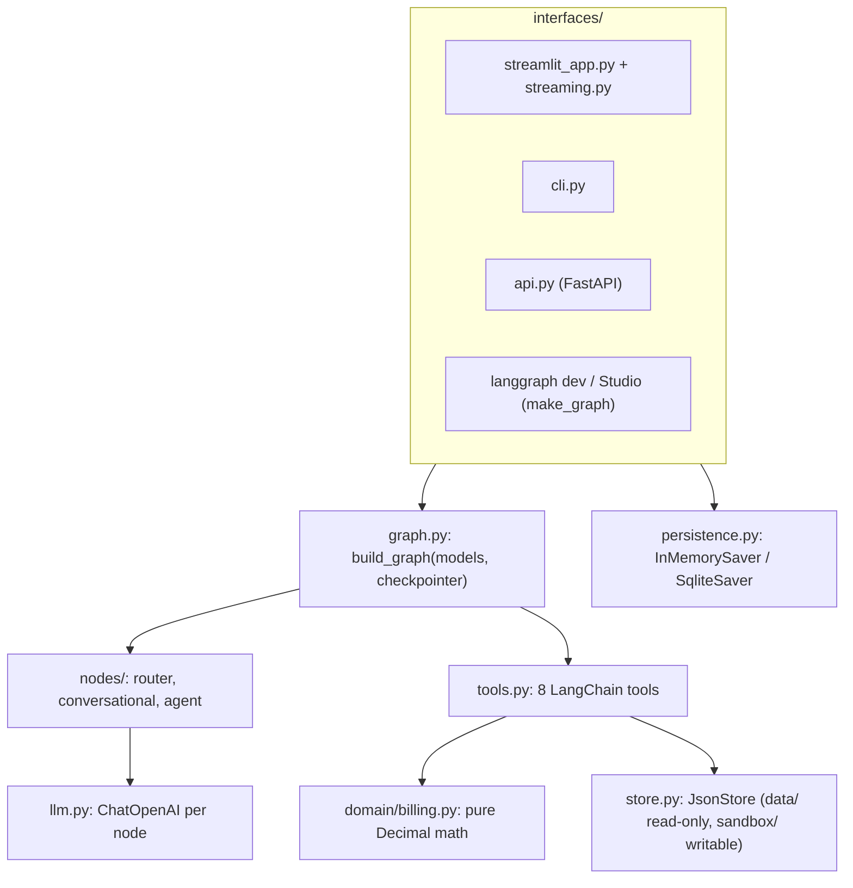
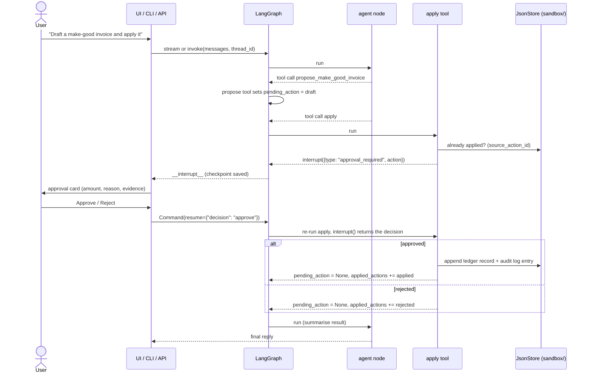

# Architecture

Notes on how the graph is put together. The [README](../README.md) has the
overview, quickstart and demo; this page goes one level deeper. Everything here
describes the code in `src/revenue_leakage_agent/`.

## Contents

- [Layers](#layers)
- [State schema](#state-schema)
- [Nodes](#nodes)
- [Tool catalogue](#tool-catalogue)
- [The deterministic comparison](#the-deterministic-comparison)
- [Approval and rollback](#approval-and-rollback)
- [Persistence](#persistence)
- [Runtime context](#runtime-context)
- [History budgets](#history-budgets)
- [Interfaces](#interfaces)
- [Observability](#observability)
- [Error handling](#error-handling)

## Layers



`build_graph()` takes the models and the checkpointer as arguments. Tests pass
scripted models; interfaces pass a checkpointer from `build_checkpointer()`;
Studio uses `make_graph()`, which attaches none because the platform brings
its own.

## State schema

`AgentState` (`state.py`) is a `TypedDict` with `total=False`. Only `messages`
has a reducer (`add_messages`); every other key is replaced by whoever writes
it. A key without a reducer accepts one write per step, so the agent runs one
tool call per step: tools are bound with `parallel_tool_calls=False`, and the
`tools` node runs only the first call of an AIMessage that carries several,
answering the rest with a `PARALLEL_TOOL_CALL` error `ToolMessage` so the model
can retry them one at a time.

| Key | Type | Written by | Read by |
|---|---|---|---|
| `messages` | `list[AnyMessage]` (appended via `add_messages`) | every node and tool | all nodes, trimmed per node |
| `route_decision` | `RouteDecision` as dict | `router` | `route_from_decision`, `conversation` |
| `active_scope` | `InvestigationScope` as dict | `router` (adds `resolved_question`), `load_plan` (plan, customer, mode) | `router`, `agent` |
| `findings` | list of `Finding` dicts | `query_invoices` (replaced on each call; empty when no `plan_id` filter) | `agent`, `propose_*` (to attach evidence) |
| `pending_action` | one draft (`MakeGoodInvoiceDraft`, `CreditMemoDraft` or `PlanAmendmentDraft`) | `propose_*` sets it; `apply` clears it | `apply`, `agent` |
| `applied_actions` | list of action records (`applied`, `rejected`, `rolled_back`) | `apply`, `rollback` | `rollback`, `agent` |
| `last_error` | `ToolError` as dict | any tool returning a structured error | `agent` |

`last_error` is not cleared on the next successful call; the agent prompt treats
it as "the most recent error", not "the current error".

The agent node sends `active_scope`, `findings`, `pending_action`,
`applied_actions` and `last_error` to the model as a separate JSON system
message, right after the static prompt.

## Nodes

| Node | Model (default) | What it does |
|---|---|---|
| `router` | `gpt-5.4-mini` with `with_structured_output(RouteDecision, method="json_schema", strict=True)` | Classifies the turn as `conversation` or `investigation` (with an `intent` and `reason`) and optionally writes a `resolved_question` for implicit follow-ups ("and the other months?"). Sees the active scope and the recent dialogue only. |
| `conversation` | `gpt-5.4-mini` | Greetings, capability questions, general concepts, out-of-scope redirects. No tools. |
| `agent` | `gpt-5.4-2026-03-05` with the 8 tools bound (`parallel_tool_calls=False`) | The investigator. Loops with `tools` until it answers without tool calls (`tools_condition` → `END`). |
| `tools` | none | `build_tool_node()`: a `ToolNode` that turns tool exceptions into error `ToolMessage`s (approval interrupts still propagate) and runs one tool call per step. |

Model names, reasoning effort and timeouts are per node and come from `.env`
(see `config.py`). The agent turn is bounded by LangGraph's default
`recursion_limit`.

## Tool catalogue

All tools receive a `ToolRuntime[AgentContext, AgentState]`, which gives them
the run's store, the current state and the tool-call ID. Most return a
`Command(update=...)` so they can change state as well as add a `ToolMessage`.

| Tool | Kind | State updates | Interrupt |
|---|---|---|---|
| `load_plan(plan_id)` | read | `active_scope` | no |
| `query_invoices(plan_id?, customer_name?, start_date?, end_date?, status?, currency?, limit=25)` | read | `findings` (from the plan comparison) | no |
| `fx_convert(amount, from_ccy, to_ccy, on_date)` | read | none (returns a dict) | no |
| `propose_make_good_invoice(plan_id, amount, reason)` | draft | `pending_action` | no |
| `propose_credit_memo(invoice_id, amount, reason)` | draft | `pending_action` | no |
| `propose_plan_amendment(plan_id, change_set, reason)` | draft | `pending_action` | no |
| `apply(action_id?)` | write | `pending_action = None`, append to `applied_actions` | yes |
| `rollback(action_id?)` | write | mark the target `rolled_back` in `applied_actions` | yes |

Notes:

- Plan and invoice IDs are normalised (`strip().upper()`) before lookup.
- Make-good and credit-memo drafts copy the `evidence` of the matching finding
  (same plan or invoice, same amount), so the approval card shows why the
  correction exists. With no match they fall back to a one-line note. Plan
  amendment drafts record the current plan terms and the proposed change set.
- A credit memo is denominated in the plan currency, or in the invoice currency
  for an orphan invoice.
- `query_invoices` always runs the plan comparison over all of the plan's
  invoices; the filters only narrow the invoice list returned to the model.

## The deterministic comparison

`compare_plan_to_invoices()` in `domain/billing.py` is where the numbers come
from:

1. Expected amount per period = `total_value / periods_per_year` (Monthly 12,
   Quarterly 4, Annual 1), rounded half-up to cents.
2. Periods are rebuilt from the plan `start_date` in cadence steps up to the
   last invoice's `issue_date`; period k starts at `start_date` plus k cadence
   steps, clamped to the month end (a Jan 31 monthly start gives Feb 28,
   Mar 31, Apr 30). A plan with no invoices produces no periods.
3. Each invoice lands in the period containing its `issue_date`. Foreign
   currency invoices are converted with the exact-date FX rate; the evidence
   string records amount, rate, date and rounding policy.
4. Each period gets a status: `ok`, `missing_invoice` (only for empty periods
   between the first and last billed period), `underbilling` or `overbilling`.
5. Non-`ok` periods become `Finding`s. Overbilling that existing credit memos
   (converted if needed) fully cover becomes `already_corrected` with
   `recommended_action="none"`. A mismatch with FX involved is typed
   `fx_mismatch`.

The golden test (`tests/integration/test_dataset_golden.py`) pins the result
for every plan in `data/`.

## Approval and rollback



Details worth knowing:

- On resume LangGraph re-runs the `apply` tool from the start, and `interrupt()`
  returns the resume value the second time. Everything before `interrupt()` is
  a read, so running it twice is harmless.
- The decision is accepted as a string or as `{"decision": ...}`.
  `approve`/`approved`/`yes`/`si` (accents ignored) count as approval; anything
  else is a rejection.
- `apply` refuses (`ACTION_ALREADY_APPLIED`, non-recoverable) when a live ledger
  record already carries the draft's `action_id`, and does so before
  interrupting, so a double apply never asks twice.
- `rollback` targets the most recent `applied` action, or a specific
  `action_id`, and asks for approval the same way. On approval it removes the
  ledger record, writes an `action_rolled_back` audit entry and marks the action
  `rolled_back` in state. A rejected rollback changes nothing.
- The API rejects a new message while an approval is pending (HTTP 409), and
  `/resume` without a pending approval is also a 409.

## Persistence

There are two kinds of state, stored separately.

**Conversation checkpoints** (LangGraph state per `thread_id`):

| Where | Checkpointer |
|---|---|
| CLI, Streamlit, API | `build_checkpointer(settings)`: `InMemorySaver` by default, `SqliteSaver` when `CHECKPOINT_DB` is set |
| Docker compose | `SqliteSaver` at `/app/state/checkpoints.sqlite` on the shared volume |
| `langgraph dev` / Studio | the platform's own; `make_graph()` compiles without one |
| tests | `InMemorySaver`, or SQLite in `test_persistence.py` |

A checkpointer is required for `interrupt()` to resume. The API refuses an
injected graph that has none. With SQLite, a conversation (including a pending
approval) survives a restart; the API closes the connection on shutdown.

**Sandbox ledgers** (the "writes"), under `SANDBOX_DIR` (default `sandbox/`,
git-ignored):

| File | Written by |
|---|---|
| `make_good_invoices.json` | approved make-good invoice (`INV-MG-0001`, ...) |
| `credit_memos.json` | approved credit memo (`CM-0001`, ...) |
| `plan_amendments.json` | approved plan amendment (`AMD-0001`, ...) |
| `audit_log.json` | every applied action and every rollback (`AUD-0001`, ...) |

Every record keeps `source_action_id`, which idempotency checks and rollbacks
use to find it. Writes go to a temp file and are then renamed over the target,
but there is no cross-process lock. `data/` is never written. The Streamlit
**Reset sandbox** button deletes only the four files above.

## Runtime context

```python
@dataclass(frozen=True)
class AgentContext:
    store: SkipJsonSchema[InstanceOf[JsonStore] | None] = None
```

Interfaces pass `context=AgentContext(store=JsonStore(settings))` on every
`stream`/`invoke`. Tools call `resolve_store(runtime.context)`, which falls back
to `JsonStore(get_settings())` when the store is missing. That fallback is
what lets LangGraph Studio run the graph with `{}` as context.
`SkipJsonSchema` keeps the store out of the context JSON schema Studio renders.

## History budgets

`history.py` wraps `trim_messages` with `token_counter=len`, so the budget
counts messages, not tokens:

- `recent_history(messages, AGENT_HISTORY_MESSAGES=40)` for the agent: the last
  N messages starting on a `HumanMessage`, so a `ToolMessage` is never separated
  from the `AIMessage` that called it. If the current turn alone is longer than
  N, the whole turn is kept. Before trimming it drops any `AIMessage` whose
  tool calls were never all answered, plus any `ToolMessage` without its
  parent, so an abandoned turn (a UI rerun mid-stream, a new message sent
  instead of resuming an approval) can't make the provider reject later turns.
- `dialogue_history(messages, ROUTER_HISTORY_MESSAGES=12)` for the router and
  conversational nodes: only human messages and assistant messages with text
  and no tool calls, then the same trimming.

The checkpoint keeps the full history; trimming only affects what each model
call sees.

## Interfaces

| Interface | Entry point | Notes |
|---|---|---|
| Streamlit | `uv run task ui` | Streams tokens with `stream_mode=["messages", "updates"]`. Only `agent` and `conversation` tokens reach the chat; the router's structured-output tokens are filtered out. The interrupt is taken from the `updates` stream (with `get_state()` as a fallback) and drawn as an approval card. The sidebar shows the thread ID, audit log, **New conversation** and **Reset sandbox**. |
| CLI | `uv run task cli` | `stream_mode="updates"`, prints every chunk and state change as a trace, and asks `approve/reject` on interrupts. |
| HTTP API | `uv run task api` | FastAPI with sync endpoints (the graph is sync). Models and the checkpointer are built in the lifespan, so importing the module needs no API key. |
| Studio | `uv run task studio` | `langgraph dev` via `uvx` with `langgraph.json` pointing at `graph.py:make_graph`. |

API endpoints:

| Method and path | Body | Result |
|---|---|---|
| `GET /health` | | `{"status": "ok"}` |
| `POST /threads` | | `{"thread_id": ...}` (a new UUID; nothing is stored until the first message) |
| `POST /threads/{id}/messages` | `{"content": "..."}` | `TurnResponse`: this turn's replies and the pending interrupt, if any. 409 if an approval is pending. |
| `POST /threads/{id}/resume` | `{"decision": "approve" \| "reject"}` | `TurnResponse`. 404 for an unknown thread, 409 if nothing is pending. |
| `GET /threads/{id}` | | `active_scope`, `findings`, `pending_action`, `applied_actions`, `interrupt`. 404 for an unknown thread. |

## Observability

Tracing is optional and uses [Langfuse](https://langfuse.com). When
`LANGFUSE_SECRET_KEY`, `LANGFUSE_PUBLIC_KEY` and `LANGFUSE_BASE_URL` are all
set, `tracing.py` builds the Langfuse client once per credential set and each
node adds a Langfuse `CallbackHandler` to its model call. If any key is
missing, the agent runs untraced. If the keys are set but the client or
handler can't be built, it logs a warning and also runs untraced.

The handler is merged into the node's inherited run config
(`merge_configs(ensure_config(), ...)`) instead of replacing it. Replacing it
would detach the model call from the graph run, and LangGraph's `messages`
stream mode would stop seeing tokens. Tests force the Langfuse variables empty
so they never send traces.

## Error handling

- **Expected errors** (unknown plan or invoice, nothing to apply, nothing to
  roll back, empty change set, already applied) come back as a `ToolError`
  with `error_code`, `message`, `recoverable` and an `llm_instruction` the
  prompt tells the model to follow. They also set `last_error`.
- **Unexpected exceptions** inside a tool (for example a missing FX rate, or an
  unsupported currency filter) are caught by the `tools` node (`build_tool_node()`)
  and returned to the model as an error `ToolMessage`, so the turn still ends
  with a reply.
- **Setup errors**: without `OPENAI_API_KEY`, `build_default_models()` raises a
  `RuntimeError`, and the Streamlit app shows setup instructions instead of a
  stack trace. An exception during a Streamlit turn is logged and shown as a
  short error message in the chat.
